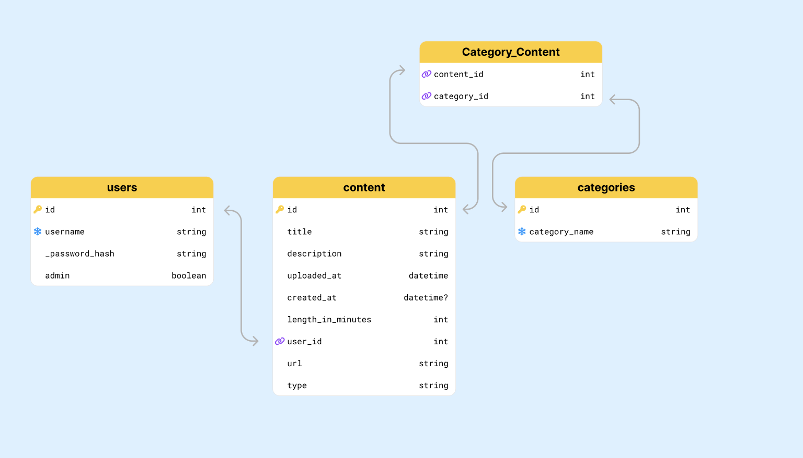

## Phase 5 Project - Personal Page

[ ] Use a Flask/SQLAlchemy API backend with a React frontend.
[ ] Have at least 4 models on the backend, that include the following:
[ ] At least 1 many-to-many relationship.
[ ] Full CRUD actions for at least one resource, following REST conventions.
[ ] User can interact with all models, directly or indirectly (no unused models).
[ ] Have at least 3 different client-side routes using React Router. Be sure to include a nav bar or other UI element that allows users to navigate between routes.
[ ] Implement password hashing and authentication.
[ ] Validations implemented on frontend and backend
[ ] Use SQLAlchemy validations to verify and protect data on the backend.
[ ] Use forms and validation through Formik on all input.
[ ] At least one data type validation.
[ ] At least one string/number format validation.
[ ] Connect the client and server using fetch().

# Stretch

[ ] [optional/highly recommended] Implement something new not taught in the curriculum. (Check in with your instructor to ensure the scope of your idea is appropriate.)
[ ] [optional/highly recommended] Implement useContext or Redux.
[ ] [optional/highly recommended] Fully deploy and host your project.

# User Stories

[ ] As a new user, I want to register for an account so that I can access the app and personalize my content.
[ ] As a registered user, I want to log in securely so that I can access my personalized content and preferences.
[ ] As a logged-in user, I want to manage my profile information so that I can keep my details up-to-date.
[ ] As a user, I want to reset my password securely in case I forget it so that I can regain access to my account.
[ ] As a user, I want to edit and delete my content so that I can correct errors or remove irrelevant information.
[ ] As an organized user, I want to create categories for my content so that I can manage them efficiently.

# Models

# Execution

#
